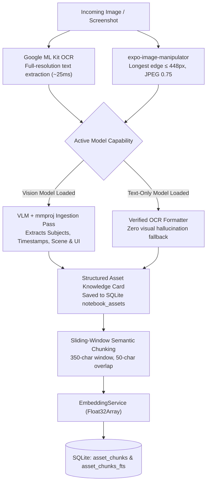
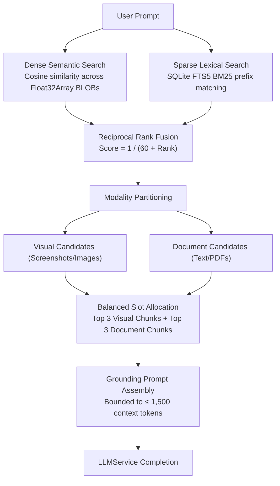
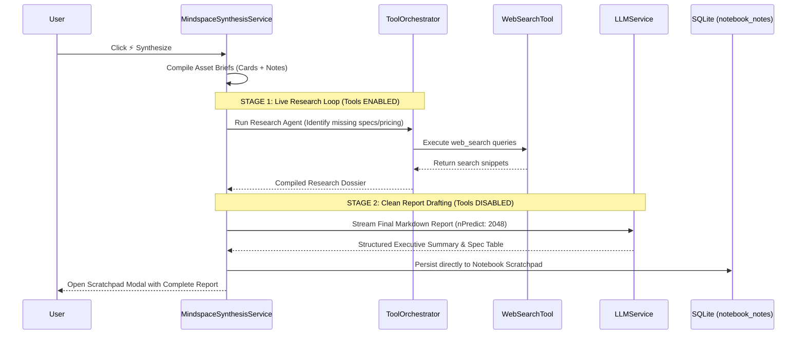
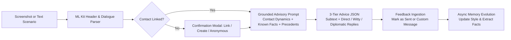

# EdgeAnalyzer 📱⚡

**EdgeAnalyzer** is an open-source, on-device multimodal AI assistant and personal intelligence engine for Android. Built with React Native, Expo SDK 54, and native `llama.cpp` bindings (`llama.rn`), it executes local inference for large language models (LLMs), vision-language models (VLMs), and embeddings directly on mobile GPUs without relying on cloud servers.

MVP 2.0 expands EdgeAnalyzer into an integrated on-device knowledge and communication suite with four core workspaces:

* **💬 Conversational Chat**: Local multi-session chat with cross-session semantic memory and autonomous tool calling.
* **🎨 Ephemeral Studio**: Rapid single-turn document, receipt, and scene inspection using a hybrid OCR-VLM pipeline.
* **📚 MindSpace Notebooks**: An on-device multimodal research workspace (NotebookLM-style) featuring asset ingestion (screenshots, photos, documents), Modality-Balanced Hybrid Retrieval (FTS5 + Cosine RRF), and two-stage deep web research synthesis.
* **🤝 Message Profiler & Advisor**: An interpersonal communication advisor that analyzes conversational subtext from chat screenshots or text scenarios, generates 3-tier strategic reply options, tracks contact dynamics, and evolves communication style preferences through user feedback.

---

## 1. System Overview & Core Stack

| Area | Technology | Purpose |
| --- | --- | --- |
| **Framework** | React Native 0.81.5 / Expo SDK 54 | Native Android application runtime and UI |
| **Inference Runtime** | `llama.rn` (v0.13.0-rc.0) / `llama.cpp` | On-device GGUF inference via native C++/JNI bindings |
| **GPU Acceleration** | OpenCL / Adreno | Hardware acceleration for Snapdragon mobile chipsets |
| **Vision & OCR** | Google ML Kit + `expo-image-manipulator` | High-precision on-device OCR (~25ms) and 448px image downscaling |
| **Database** | `expo-sqlite` / SQLite 3 | WAL mode, SQLite FTS5 full-text search, and vector blob storage |
| **Secure Storage** | `expo-secure-store` / Android Keystore | Hardware-backed AES-256 storage for API credentials |
| **Native Storage Bridge** | Custom `ModelFileModule` | Android SAF `content://` URI resolution and GGUF header verification |
| **System Utilities** | `expo-clipboard`, `expo-document-picker` | Native clipboard interaction and multi-format document picking |

---

## 2. Directory Structure

```text
EdgeAnalyzer/
├── app/
│   ├── _layout.tsx                         # Root layout, Safe Area Provider & Global Theme
│   └── index.tsx                           # Main Chat Controller, Workspace Switcher & Routing
├── modules/
│   └── model-file/                         # Custom Native Android Module
│       ├── android/                        # Native Java/Kotlin SAF resolver & GGUF validator
│       ├── index.ts                        # TypeScript bridge
│       └── src/
│           └── ModelFileModule.ts          # Native method signatures
├── src/
│   ├── components/
│   │   ├── ConversationDrawer.tsx          # Workspace navigation & historical conversation threads
│   │   ├── ModelRegistryModal.tsx          # Text GGUF / Vision Pair (Base + mmproj) manager
│   │   └── SearchSettingsModal.tsx         # Search provider and API key configuration
│   ├── database/
│   │   ├── db.ts                           # SQLite initialization, WAL mode, FTS5 virtual tables
│   │   └── repository.ts                   # Complete CRUD operations for Models, Notebooks, Contacts, and Vectors
│   ├── models/
│   │   └── types.ts                        # Core domain contracts and metadata types
│   ├── screens/
│   │   ├── StudioScreen.tsx                # Ephemeral multimodal vision playground
│   │   ├── advisor/
│   │   │   ├── AdvisorWorkspaceScreen.tsx  # Chat OCR / scenario advisor with 3-tier replies & feedback
│   │   │   ├── ContactDetailScreen.tsx     # Contact profile, style dynamics, and interaction timeline
│   │   │   └── RelationshipHubScreen.tsx   # Contact directory, search filter, and quick mode launcher
│   │   └── mindspace/
│   │       ├── AssetViewerModal.tsx        # Asset inspector with OCR text, knowledge card, and notes
│   │       ├── MindspaceHomeScreen.tsx     # Notebook cards directory, color tags, and project creator
│   │       └── NotebookDetailScreen.tsx    # Dual-Scope RAG chat, asset shelf, and scratchpad modal
│   ├── services/
│   │   ├── CommunicationAdvisorService.ts  # OCR dialogue extraction, subtext analysis, and style evolution
│   │   ├── ContextManager.ts               # Token sliding-window context assembly
│   │   ├── DocumentInspectorService.ts     # ML Kit OCR + 448px image preprocessing
│   │   ├── EmbeddingService.ts             # Dedicated background embedding instance
│   │   ├── LLMService.ts                   # llama.rn engine lifecycle, streaming, and sampling
│   │   ├── MindspaceIngestionService.ts    # Asset staging, OCR extraction, knowledge card generation, and chunking
│   │   ├── MindspaceRAGService.ts          # Hybrid RRF (FTS5 + Vector) retrieval & modality-balanced RAG
│   │   ├── MindspaceSynthesisService.ts    # Two-stage autonomous web research & scratchpad report generator
│   │   ├── ModelManager.ts                 # Permanent storage staging, post-restart safe loader, slot manager
│   │   ├── SecureStorageService.ts         # Encrypted API key management (Keystore)
│   │   ├── SemanticMemoryService.ts        # Turn fact extraction and cross-session vector recall
│   │   └── ToolOrchestrator.ts             # Multi-step tool execution loop & fallback JSON extraction
│   └── tools/
│       ├── CalculatorTool.ts               # Safe mathematical expression evaluator
│       ├── DeviceLocationTool.ts           # On-device GPS coordinate resolver
│       ├── ToolRegistry.ts                 # Central tool registry
│       ├── types.ts                        # Tool interface definitions
│       ├── WeatherTool.ts                  # Open-Meteo REST API client
│       └── WebSearchTool.ts                # Keyless Tavily & Brave Search API integration

```

---

## 3. Core Architectural Pipelines

### A. Hybrid OCR-VLM & Structured Knowledge Card Ingestion

To eliminate out-of-memory (OOM) crashes and avoid the "information evaporation" that occurs when dropping the multimodal projector (`mmproj`) on subsequent turns, visual assets are converted into permanent, structured textual knowledge representations:



**Subsequent Q&A:** Queries against the asset bypass the vision projector completely. Responses execute with text-only performance (~120ms TTFT) using the structured knowledge card and OCR text.

---

### B. Dual-Scope Hybrid Retrieval (Reciprocal Rank Fusion)

MindSpace notebooks support two querying scopes:

1. **Single-Asset Scope (`target_asset_id != null`)**: Grounds generation on the target asset's structured card, attached user notes, and complete OCR text.
2. **Global Notebook Scope (`target_asset_id == null`)**: Executes hybrid search across all assets in the notebook.

To prevent large documents from crowding out screenshots, EdgeAnalyzer uses **Modality-Balanced Reciprocal Rank Fusion (RRF)**:



---

### C. Two-Stage Autonomous Deep Web Research & Synthesis

When running `⚡ Synthesize` on a research notebook, the pipeline prevents tool-calling runaway and output truncation by splitting the task into two isolated execution stages:



---

### D. Interpersonal Profiler & Communication Advisor Loop

The relationship advisor analyzes conversational dynamics and refines contact profiles over time:



---

## 4. Hardware & VRAM Memory Budget

Model loading parameters in `LLMService.ts` are tuned for mobile SoC architectures (Snapdragon / Adreno):

| Setting | Value | Operational Reason |
| --- | --- | --- |
| `use_mlock` | `false` | Prevents RAM locking and Android `SurfaceFlinger` deadlocks |
| `n_gpu_layers` | `99` | Offloads all supported transformer layers to the Adreno GPU via OpenCL |
| `n_threads` | `4` | Minimizes thread contention on performance cores |
| Text `n_ctx` | `4096` | Context window allocation for text-only inference |
| Text `n_batch` | `512` | Batch evaluation size for text processing |
| Vision `n_ctx` | `2048` | Dedicated context window to conserve VRAM during vision passes |
| Vision `n_batch` | `256` | Reduced batch evaluation size for multimodal projector layers |
| Synthesis `n_predict` | `2048` | Output token budget for multi-page research synthesis |

---

## 5. Database Schema (`edge_analyzer.db`)

SQLite persistence uses Write-Ahead Logging (WAL) and foreign-key cascades.

### A. Core Engine & Conversations

#### `models`

| Column | Type | Description |
| --- | --- | --- |
| `id` | `TEXT PRIMARY KEY` | Unique UUID |
| `original_name` | `TEXT NOT NULL` | Display filename |
| `original_uri` | `TEXT NOT NULL` | Permanent `file://` URI in internal application storage |
| `size_bytes` | `INTEGER` | Binary file size |
| `is_default` | `INTEGER DEFAULT 0` | `1` if default chat model |
| `is_embedding` | `INTEGER DEFAULT 0` | `1` if locked for background embeddings |
| `modality` | `TEXT DEFAULT 'text'` | `'text'` or `'vision'` |
| `mmproj_uri` | `TEXT` | Permanent `file://` URI to companion vision projector |
| `mmproj_filename` | `TEXT` | Companion projector filename |
| `mmproj_size_bytes` | `INTEGER` | Projector binary size |
| `created_at` | `INTEGER NOT NULL` | Epoch timestamp (ms) |

#### `conversations` & `messages`

* `conversations`: Manages thread metadata, custom titles, and associated model IDs.
* `messages`: Stores chat turns (`system`, `user`, `assistant`) with token counts.
* `messages_fts`: SQLite FTS5 virtual table synchronized via repository transactions for full-text message search.
* `user_facts`: Cross-session memory facts paired with Float32Array vector embeddings.

---

### B. MindSpace Multimodal Notebooks

#### `notebooks`

| Column | Type | Description |
| --- | --- | --- |
| `id` | `TEXT PRIMARY KEY` | `nb_<timestamp>_<uuid>` |
| `title` | `TEXT NOT NULL` | Notebook title |
| `description` | `TEXT` | Optional project objective |
| `color_tag` | `TEXT DEFAULT '#3B82F6'` | Hex color identifier |
| `notebook_notes` | `TEXT DEFAULT ''` | Global scratchpad containing autonomous synthesis reports |
| `created_at` | `INTEGER NOT NULL` | Epoch timestamp (ms) |
| `updated_at` | `INTEGER NOT NULL` | Last modification timestamp (ms) |

#### `notebook_assets`

| Column | Type | Description |
| --- | --- | --- |
| `id` | `TEXT PRIMARY KEY` | `asset_<timestamp>_<uuid>` |
| `notebook_id` | `TEXT NOT NULL` | Foreign key referencing `notebooks(id)` ON DELETE CASCADE |
| `type` | `TEXT NOT NULL` | `'screenshot'` | `'image'` | `'text_note'` | `'document'` |
| `title` | `TEXT NOT NULL` | Asset title / filename |
| `file_uri` | `TEXT` | Permanent app-private storage URI |
| `extracted_text` | `TEXT` | Full-resolution ML Kit OCR or raw document text |
| `structured_card` | `TEXT` | Grounded Markdown knowledge card |
| `user_note` | `TEXT DEFAULT ''` | User notes attached to this asset |
| `metadata_json` | `TEXT` | Dimensions, file sizes, token estimates |
| `created_at` | `INTEGER NOT NULL` | Epoch timestamp (ms) |

#### `asset_chunks` & `asset_chunks_fts`

* `asset_chunks`: Stores 350-character sliding-window text chunks, token counts, and Float32Array vector embeddings (`BLOB`).
* `asset_chunks_fts`: FTS5 virtual table indexing `chunk_text` for keyword and model-number retrieval.

#### `notebook_conversations` & `notebook_messages`

* `notebook_conversations`: Scoped conversation threads. `target_asset_id IS NULL` indicates Global Notebook RAG, while an asset ID scopes retrieval to a single asset.
* `notebook_messages`: Stores message turns along with `sources_json` containing cited asset references.

---

### C. Relationship Profiler & Advisor

#### `contacts`

| Column | Type | Description |
| --- | --- | --- |
| `id` | `TEXT PRIMARY KEY` | `contact_<timestamp>_<uuid>` |
| `name` | `TEXT NOT NULL` | Contact name |
| `platform_handle` | `TEXT` | `@username`, phone number, or email |
| `default_platform` | `TEXT NOT NULL` | `'whatsapp'` | `'instagram'` | `'slack'` | `'email'` | `'imessage'` | `'linkedin'` |
| `relationship_type` | `TEXT NOT NULL` | `'Friend'` | `'Colleague'` | `'Manager'` | `'Dating'` | `'Family'` | `'Client'` |
| `communication_style` | `TEXT` | Evolving description of conversation dynamics |
| `profile_summary` | `TEXT` | Summary of relationship dynamics |
| `avatar_color` | `TEXT DEFAULT '#8B5CF6'` | UI avatar accent color |
| `created_at` | `INTEGER NOT NULL` | Epoch timestamp (ms) |
| `updated_at` | `INTEGER NOT NULL` | Last interaction timestamp (ms) |

#### `contact_interactions`

| Column | Type | Description |
| --- | --- | --- |
| `id` | `TEXT PRIMARY KEY` | `inter_<timestamp>_<uuid>` |
| `contact_id` | `TEXT` | Foreign key referencing `contacts(id)` (NULL for Anonymous Quick Mode) |
| `source_type` | `TEXT NOT NULL` | `'screenshot'` | `'manual_text'` |
| `screenshot_uri` | `TEXT` | Permanent file URI of the chat screenshot |
| `raw_transcript` | `TEXT NOT NULL` | Parsed dialogue |
| `situation_summary` | `TEXT` | Generated strategic synopsis |
| `detected_sentiment` | `TEXT` | `'positive'` | `'neutral'` | `'tense'` | `'urgent'` | `'playful'` |
| `user_intent` | `TEXT` | Target tone or custom goal |
| `selected_reply` | `TEXT` | The reply option marked as sent |
| `custom_reply_feedback` | `TEXT` | User's actual sent reply used to adapt style preferences |
| `created_at` | `INTEGER NOT NULL` | Epoch timestamp (ms) |

#### `contact_facts`

Stores atomic facts extracted from dialogues (e.g., *"Prefers oat milk"*, *"Works as product designer"*) with vector embeddings for semantic recall during advisory generation.

---

## 6. Tool Orchestration Contract

The `ToolOrchestrator` implements an agent loop bounded to **3 tool-execution iterations per turn**.

Models request tools via structured JSON payloads:

```json
{
  "tool": "<tool_name>",
  "parameters": {
    "<param_key>": "<param_value>"
  }
}

```

### Supported Tools

1. `calculator`: Evaluates mathematical expressions using a sandboxed AST parser.
2. `weather`: Queries Open-Meteo via GPS coordinates or geocoded location names.
3. `device_location`: Fetches on-device GPS coordinates using Expo Location.
4. `web_search`:
* Default: Tavily Keyless endpoint.
* Pro: Brave Search API (`[https://api.search.brave.com/res/v1/web/search](https://api.search.brave.com/res/v1/web/search)`) with AES-256 encrypted keys in Android Keystore.


---

## 7. Application Architecture & Navigation

The main interface provides four distinct workspaces accessible from the side drawer:

```text
Drawer Navigation (☰)
├── 💬 Chat Assistant
│   ├── Multi-session thread drawer
│   ├── On-device tool calling
│   └── Cross-session memory recall
├── 🎨 Visual Studio
│   ├── Ephemeral single-turn analysis
│   └── Document & receipt OCR inspection
├── 📚 MindSpace Notebooks
│   ├── Multi-asset research folders
│   ├── Dual-Scope Hybrid RAG (Global vs. Single-Asset)
│   ├── Structured Knowledge Cards + Notes
│   └── ⚡ Deep Research Synthesis to Scratchpad
└── 🤝 Message Advisor
    ├── Tracked contact directory & style profiles
    ├── 📸 Chat screenshot OCR & subtext analysis
    ├── 3-tier actionable reply generation
    └── Style reinforcement & anonymous quick mode

```

---

## 8. Benchmarks & Hardware Performance

Tested on **Snapdragon 8 Elite / Adreno GPU**:

| Model | Modality / Task | TTFT (First Token) | Processing Speed | Memory Footprint |
| --- | --- | --- | --- | --- |
| **Llama 3.2 3B (Q4_K_M)** | Text / Tool Chat | **~127 ms** | **~24.5 tok/s** | ~1.8 GB |
| **Llama 3.2 1B (Q4_K_M)** | Lightweight Text & Advice | **~68 ms** | **~46.2 tok/s** | ~820 MB |
| **SmolVLM 500M (Q8_0 + mmproj)** | Document / Scene QA | **~240 ms** | **~38.0 tok/s** | ~850 MB |
| **Qwen2-VL 2B (Q4_K_M + mmproj)** | Deep Visual Analysis | **~410 ms** | **~16.2 tok/s** | ~2.1 GB |
| **Google ML Kit OCR** | Full-Res Text Extraction | **~25 ms** | *Instantaneous* | ~45 MB |

---

## 9. Recommended Models

Compatible GGUF binaries can be obtained from Hugging Face:

### Text & Reasoning Models

* **Llama 3.2 3B Instruct** (`Q4_K_M` or `Q8_0`): General chat, memory synthesis, and tool execution.
* **Llama 3.2 1B Instruct** (`Q4_K_M`): Low-latency text tasks and rapid reply advice.

### Vision Models (Base Model + Companion Projector)

* **SmolVLM 500M Instruct**:
* Base: `smolvlm-500m-instruct-q8_0.gguf`
* Projector: `mmproj-smolvlm-500m-f16.gguf`


* **Qwen2-VL 2B Instruct**:
* Base: `qwen2-vl-2b-instruct-q4_k_m.gguf`
* Projector: `mmproj-qwen2-vl-2b-f16.gguf`


---

## 10. Getting Started

### Prerequisites

* Node.js (v20+ or v22.x)
* Android Studio with Android SDK API 34+
* Physical Android device with an OpenCL-compatible GPU (recommended for local acceleration)

### Installation

1. **Clone the repository:**
```bash
git clone https://github.com/your-username/EdgeAnalyzer.git
cd EdgeAnalyzer

```


2. **Install project dependencies:**
```bash
npm install

```


3. **Ensure native Expo modules are installed:**
```bash
npx expo install expo-clipboard expo-document-picker expo-image-picker expo-image-manipulator expo-sqlite expo-secure-store

```


4. **Generate native Android project files:**
```bash
npx expo prebuild --platform android

```


5. **Run the development client on a connected device:**
```bash
npx expo run:android

```


---

## 11. Usage Guide

### 1. Import Models

* Open the side drawer (☰) or top bar and tap the **⚙ Settings** icon.
* Import a text `.gguf` model or a **Vision Pair** (Base `.gguf` + Companion `mmproj.gguf`).
* Imported binaries are automatically verified and staged into internal app storage.

### 2. MindSpace Multimodal Notebooks

* Switch to **📚 MindSpace** via the side drawer.
* Create a notebook (e.g., *"Phone Buying Research"* or *"Project Sync"*).
* Ingest assets using **📷 Photo**, **🖼️ Screenshot**, or **📄 Doc** (`.txt`, `.md`, `.pdf`, `.json`).
* Query your knowledge base using the scope toggle:
* `[ 🌐 Entire Notebook ]`: Evaluates comparisons and spec aggregations across all assets using hybrid RRF.
* `[ 🎯 Active Asset ]`: Interrogates a single asset using its full-resolution OCR and knowledge card.


* Tap **⚡ Synthesize** to run autonomous web research and generate a Markdown comparison report in the notebook scratchpad.

### 3. Relationship Profiler & Communication Advisor

* Switch to **🤝 Message Advisor** via the side drawer.
* Create a contact profile or launch **⚡ Anonymous Quick Mode**.
* Upload a chat screenshot (WhatsApp, Instagram, Slack, Gmail) or enter a text scenario.
* Select a tone preset (`[ Casual ]`, `[ Witty / Banter ]`, `[ Firm Professional ]`, `[ Diplomatic / Soft ]`) or provide a custom goal.
* Review the generated **Subtext & Dynamics** breakdown and select from the 3 tailored reply cards.
* Tap **✓ Mark as Sent** or paste your actual response into **"Sent something different?"** to adapt the contact's style profile for future recommendations.

---

## 12. Security & Privacy Guarantees

* **100% Local Inference**: LLM text generation, vision inspection, and vector embeddings run strictly on-device.
* **Local-First Persistence**: Conversations, screenshots, OCR text, contact profiles, and vector chunks remain in local SQLite tables and private app storage.
* **Hardware-Backed Key Storage**: API tokens for web search providers (Brave / Tavily) are encrypted using AES-256 via the Android Keystore.
* **Scoped External Connectivity**: Outbound network requests occur only when tools are explicitly invoked (such as Open-Meteo weather lookups or Brave web searches).

---

## 13. Project Status

**MVP 2.0**

MVP 2.0 introduces persistent multimodal research notebooks (MindSpace) and relationship intelligence profiling alongside the core chat and ephemeral vision engines.
